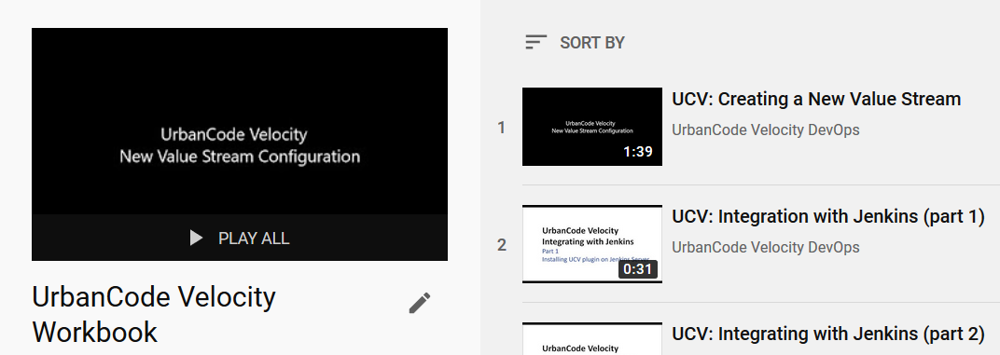
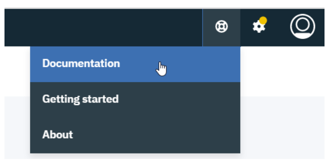

UrbanCode Velocity Workbook
v1.0 (9/24/2019)

## Scenario 1: Basic Value Stream Management (VSM) with JIRA, GitHub, Jenkins

The goal of this scenario is to create a brand-new value stream along with supporting integrations and to exercise it from beginning to end.

First, we will create the integrations that we need. This is mostly done through the Velocity settings page; however, we will need information about the external tools we're integrating. In the case of Jenkins, we will need to install the UrbanCode Velocity plugin on the Jenkins server.

After creating integrations, we will frame-out a new value stream by defining its phases and stages. We will be introduced to the VSM json file and its configuration importance. The Jira and GitHub integrations will need to be added to the value stream via the vsm.json file; however, the Jenkins integration will be automatically included in the value stream so long as the integration exists (Jenkins will require vsm.json entry in future versions of Velocity). After this, we will create stage queries. These provide logical mapping of external data to our value stream stages of interest. We will then provide link rules to map data from different sources to a single unit of interest (a work item or "dot").  We can track this dot as it moves through our logically defined stages.

Our end goal is to mimic actions of planning through deployment and observe the dot as it moves through these stages. Our supplementary goal is to experiment with value stream features such as dot behavior, stage definitions, pipelines, and history to learn its flexibility and imagine the value it might bring to one’s process.

### Before Starting
1. UrbanCode Velocity
   1.	Installed
    2.	Access to user account with roles/permissions to create a value stream and add integrations.
2. External
   1. Instances and accounts for the following:
      1.	JIRA (on premise or cloud)
      2.	GitHub (on premise or cloud)
      3.	Jenkins (on premise)
   2. Network
      1.	Velocity has network access to instances of the following: JIRA, GitHub, and Jenkins
      2.	The following have network access to Velocity: Jenkins
3. Host system access (nice to have)
   1.	Velocity host system
   2.	Jenkins host system

---

### Scenario 1

Follow each step (follow links for details).

1. Create integrations
   1. [Jira](jira/jiraIntegration.md)
   2.	[GitHub](github/githubIntegration.md)
   3. [Jenkins](jenkinsPlugin/jenkinsPlugin.md)
2. Setup value stream
   1. [Create a new Value Stream](valueStream/valueStream.md)
   2. [Configure value stream stage queries](valueStream/stageQueries/stageQueries.md)
   3. [Configure value stream link rules](valueStream/linkRules/linkRules.md)
3. Move items through value stream
   1.	Perform external actions from planning to deployment
   2.	Experiment with order of actions and value stream setup

*--- YouTube Playlist ---*

___
*This content is supplemental. Please also refer to version specific product documentation.*

