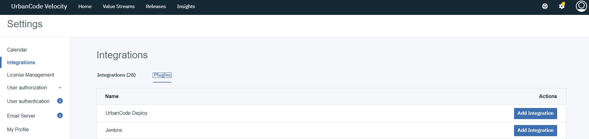
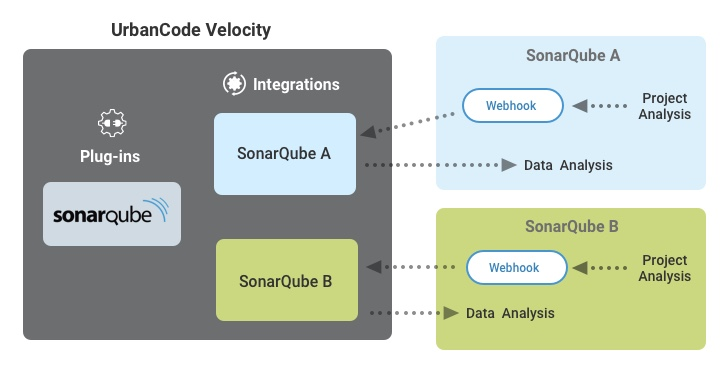

### UrbanCode Velocity Plugins and Integrations

Integrations are central to UrbanCode Velocity. There are a large number of plugins available to support many external tools. New plugins and flexibility are to be expected.

You can create an integration from plugins from under the Velocity settings page. A host of plugins are pre-installed in Velocity.

A single type of plugin might have multiple integrations due to a number of factors, such as different servers or application instances or different scopes, such as by team or project. The diagram below is an example of this for a SonarQube integration.

### Integration Control Flow: One-Way vs Two-Way
In two-way integration scenarios, such as with Jenkins, a Velocity plugin might also be installed for the external tool as well. Most of the time; however, the integration is one-way (data ingress direction) and the integration can be entirely configured out of Velocity.

### Common Integration Obstacles
- Network and certificate issues
- User accounts and authentication
  - Ability to obtain access tokens or keys
  - oAuth setup

### More About Integrations and Plugins

[\>> Introduction to UrbanCode Velocity PlugIns](https://www.urbancode.com/2019/09/30/introducing-urbancode-velocity-plug-ins/)

- [appscan](https://www.urbancode.com/plugin/appscan/)
- [azure-devops](https://www.urbancode.com/plugin/azure-devops/)
- [bitbucket](https://www.urbancode.com/plugin/bitbucket/)
- [github](https://www.urbancode.com/plugindoc/github/)
- [jenkins-pipeline](https://www.urbancode.com/plugindoc/jenkins-pipeline/)
- [jira](https://www.urbancode.com/plugindoc/jira-4/)
- [jmeter](https://www.urbancode.com/plugin/jmeter/)
- [junit](https://www.urbancode.com/plugin/junit-3/)
- [rally](https://www.urbancode.com/plugin/rally-4/)
- [sonarqube](https://www.urbancode.com/plugin/sonarqube-2/)
- [twistlock](https://www.urbancode.com/plugin/twistlock/)

