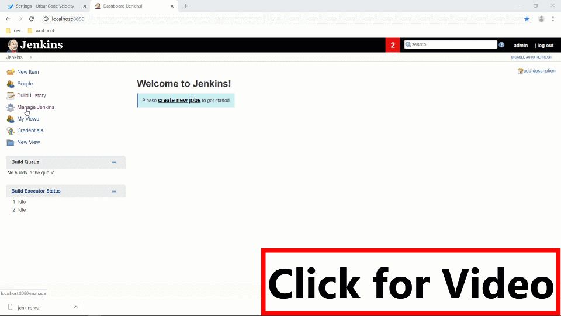
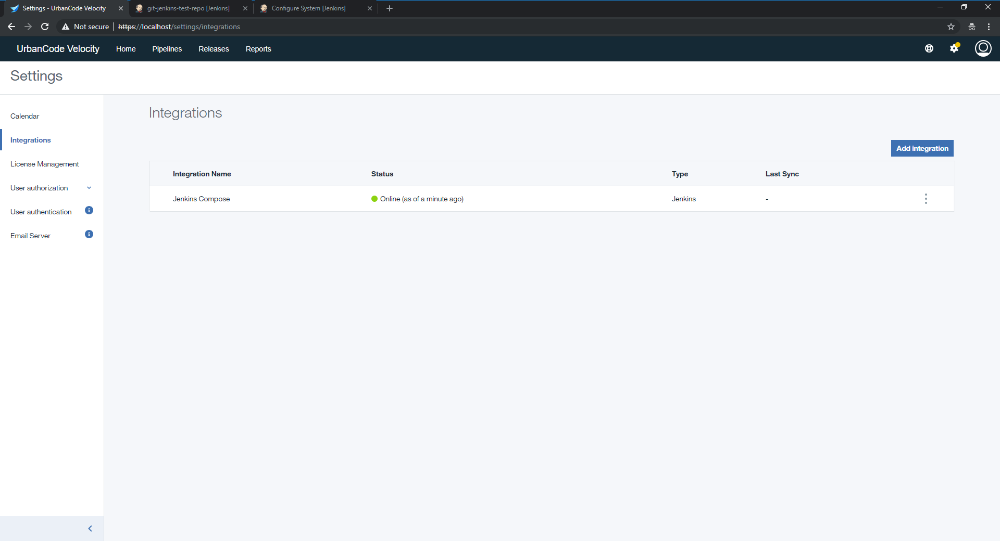
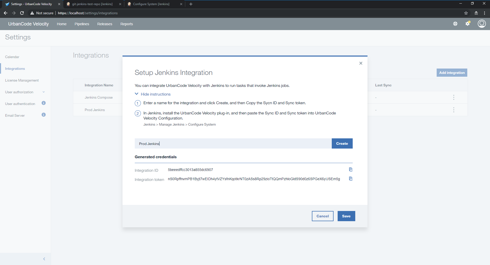
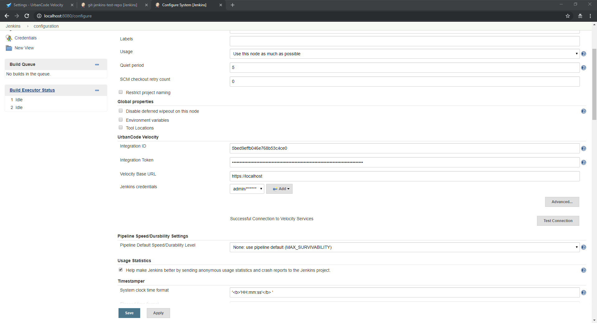

[Value Stream Basics](valueStream/valueStream.md)

# UrbanCode Velocity Plugin
With this Jenkins plugin, you can run Jenkins jobs as a part of a deployment plan in UrbanCode Velocity. You can run jobs that will trigger the creation of a version in a Velocity Pipeline as well as persist properties on that version that can be used as input properties in other Jenkins builds. This plugin will pass along important data from Git to the Velocity Pipeline.

## Installation

### 1. Install the UrbanCode Velocity plugin on your Jenkins instance

Navigate to the plugins page on your Jenkins instance by clicking `Manage Jenkins > Manage Plugins > Available (tab)` and search for `UrbanCode Velocity Plugin`.  When located install the plugin and restart your instance when possible.

If the plugin is not available in the Jenkins publically hosted plugins, please download [urbancode-velocity.hpi](http://public.dhe.ibm.com/software/products/UrbanCode/plugins/) and upload it to your Jenkins instance by navigating to the Advanced tab on the plugins page.

  
  

### 2. Configure Velocity Plugin after Creating a Corresponding Integration in UrbanCode Velocity

Navigate to the Settings Page of UrbanCode Velocity and select the Integrations section in the left navigation. Create a new Jenkins integration.

In the dialog box provide a logical name that represents the Jenkins instance that you are attempting to connect.  This will generate an Integration Id and Integration Token pair.  When the time comes this dialog provides "Copy to Clipboard" button on these fields.

Navigate to the Jenkins configuration page `Manage Jenkins > Configure System > UrbanCode Velocity (section)`.  Under the UrbanCode Velocity section paste the Integration ID and Integration Token values from Step 1 above.  Please add a credentials entry for a Jenkins user on whose behalf this plugin may access your Jenkins items.  Please `Apply` or save the values before clicking the `Test Connection` button to confirm your connection to UrbanCode Velocity.  Upon successful connection, your data will be posted to UrbanCode Velocity.

