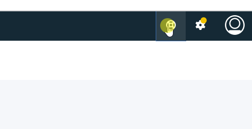

## Scenario 1: Basic Value Stream Management (VSM) with JIRA, GitHub, Jenkins

The goal of this scenario is to create a brand-new value stream along with supporting integrations and to exercise it from beginning to end.

Our first step will be to create and frame-out a new value stream by defining its phases and stages. We will be introduced to the VSM json file and its configuration importance. After this, we will setup our three data sources. Jenkins data is automatically included within value streams; however, JIRA and GitHub must be setup as integrations (Jenkins will also require integration setup in future versions of Velocity - current version is 1.3.0). Integration setup will be a three-step process: creation, addition, confirmation. Next, we will create stage queries. These provide logical mapping of external data to our value stream stages of interest. After this we will provide link rules to serve as another type of mapping, which is to map fragmented data to a single unit of interest. In the value stream paradigm, this unit of interest is a work item and is represented by a dot.  We can track this dot as it moves through our logically defined stages. Our end goal is to mimic actions of planning through deployment and observe the dot as it moves through these stages. Our supplementary goal is to experiment with value stream features such as dot behavior, stage definitions, pipelines, and history to learn its flexibility and imagine the value it might bring to one’s process.
___

#### Before Starting
1. UrbanCode Velocity
   1.	Installed
    2.	Access to user account with roles/permissions to create a value stream and add integrations.
2. External
   1. Instances and accounts for the following:
      1.	JIRA (on premise or cloud)
      2.	GitHub (on premise or cloud)
      3.	Jenkins (on premise)
   2.	Network
   1.	Velocity has network access to instances of the following: JIRA, GitHub, and Jenkins
   2.	The following have network access to Velocity: Jenkins
3. Host system access (nice to have)
   1.	Velocity host system
   2.	Jenkins host system

___

#### Getting Started
1. [Frame New Value Stream](valueStream/valueStream.md)
   1.	Create new value stream
   2.	Define stages: Introduction to VSM json
2. Setup data sources
   1. Create integrations
      1. [JIRA](jira/jiraIntegration.md)
      2.	GitHub
      3. [Jenkins](jenkinsPlugin/jenkinsPlugin.md)
   2.	Add integrations to value stream
   3.	Confirm that integrations are working
3. Create stage queries
4. Create link rules
5. Full run of value stream
   1.	Perform external actions from planning to deployment
   2.	Experiment with order of actions and value stream setup

#### REMINDER: This content is supplemental to official product documentation for your installed version.
