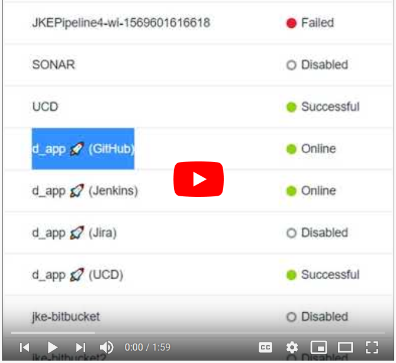

## Adding Integrations to a Value Stream

After an integration is created in Velocity, it still needs added to a value stream before usage. You can add an integration to a value stream by uploading a vsm.json configuration file. Sample entry is provided below. Refering to an integration by name is enough to add it; although, once uploaded, details will be added to the vsm.json configuration.

```json
  "integrations": [
    {
      "name":"<myIntegrationName>"
    }
  ]
```

[](https://www.youtube.com/watch?v=-PmYlqc30RA&list=PLDq88EzQBSsAcitaMxyYapVhDeHQELxXC&index=7&t=0s)