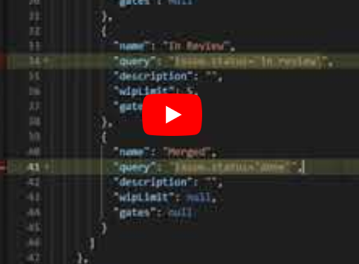

### Stage Queries

Value stream stage queries are used to determine which work items or dots appear within each stage.


#### VSM JSON Example

```
  "phases": [
    {
      "name": "Planning",
      "description": "",
      "stages": [
        {
          "name": "Backlog",
          "query": "issue.status='In Progress",
          "description": "",
          "wipLimit": null,
          "gates": null
        }
      ]
    }
```


#### Video
*Example json from video: [before](vsmBefore.md), [after](vsmAfter.md), [changes](diff.html)*

[](https://www.youtube.com/watch?v=dGqLMfeEpi0&list=PLDq88EzQBSsAcitaMxyYapVhDeHQELxXC&index=8&t=0s)

