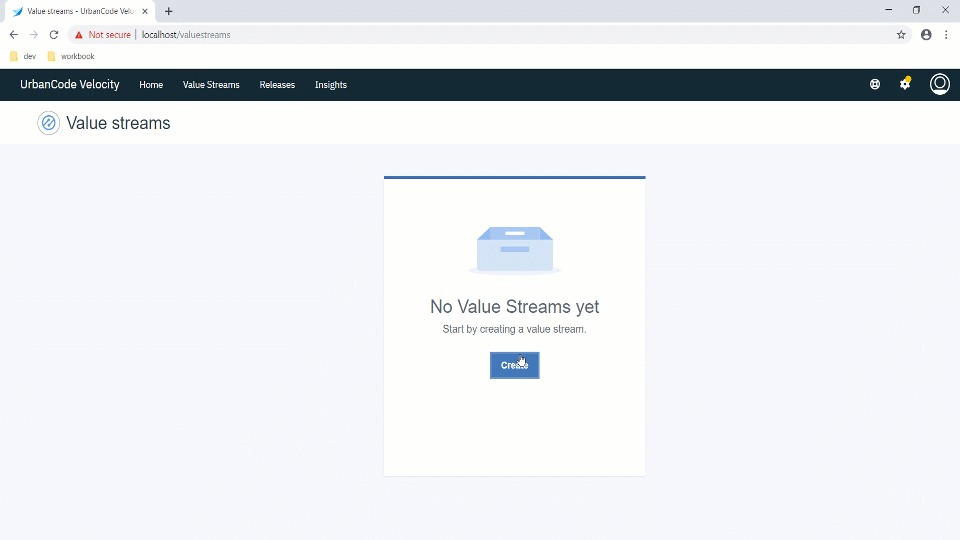
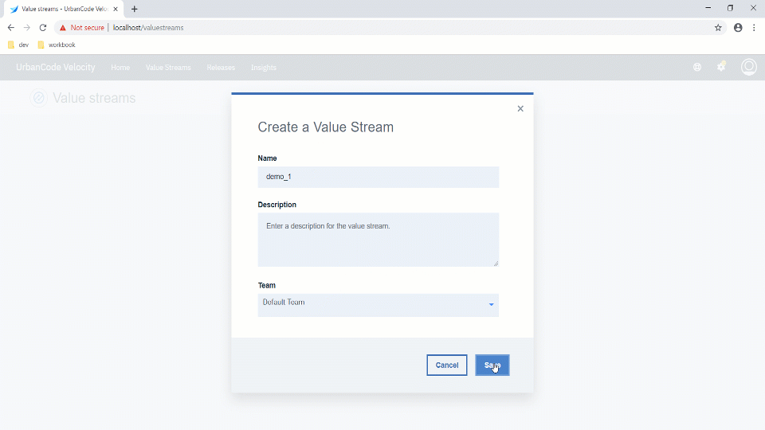
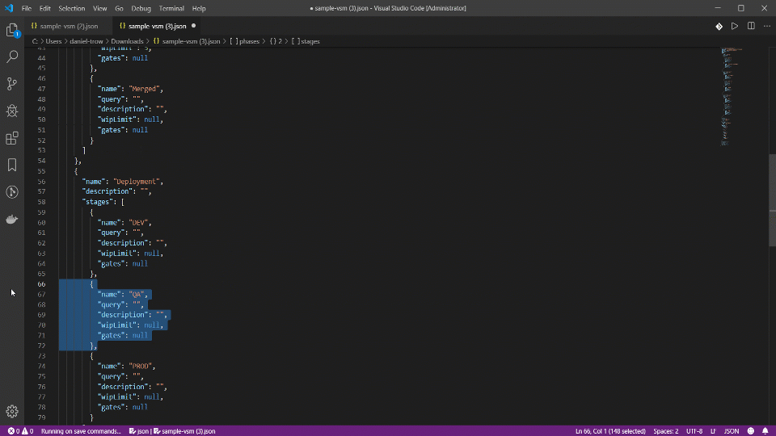
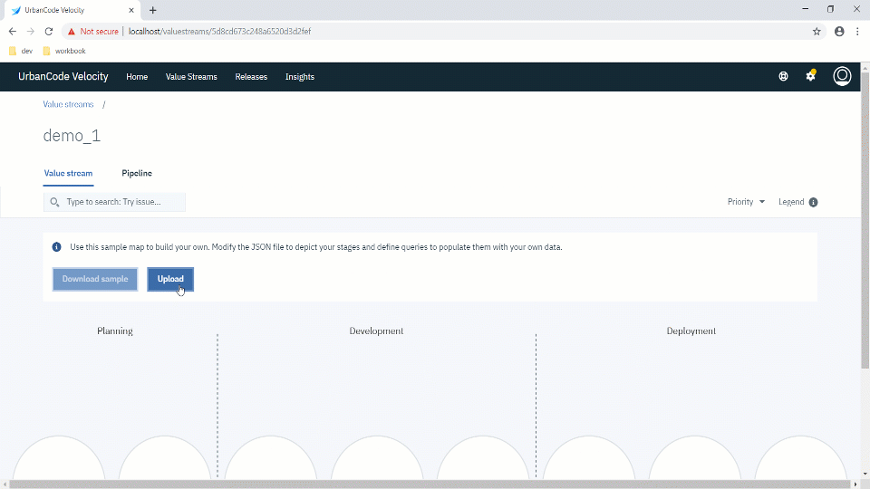
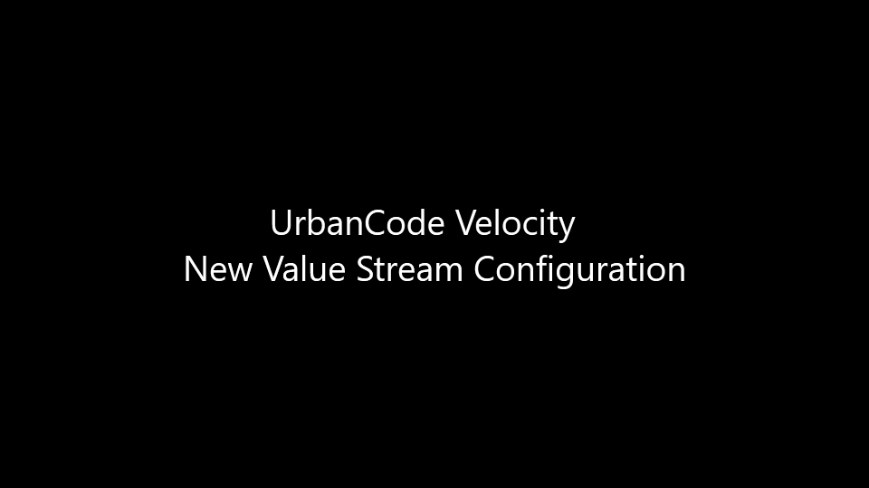

# Creating and Configuring a New Value Stream.

### 1.) Navigate to the Value Streams page and click "Create"

### 2.) Name your value stream and select the appropriate team. A detailed description is optional.

### 3.) Download the default (sample) configuration json file to start editing your value stream.

### 4.) Edit the "sample-vsm.json" file as needed. A good way to start is by defining your phases (left-to-right sections) and stages (circles).

### 5.) After done with editing the configuration file (sample-vsm.json), upload to observe the new configuration.

  
  
___
### Demo Video
[Watch on YouTube](https://www.youtube.com/watch?v=eQNYkeReOYo)
___

