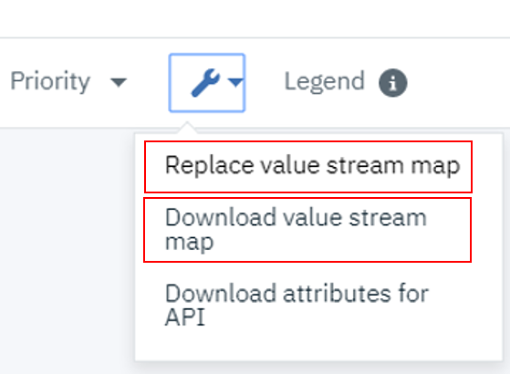
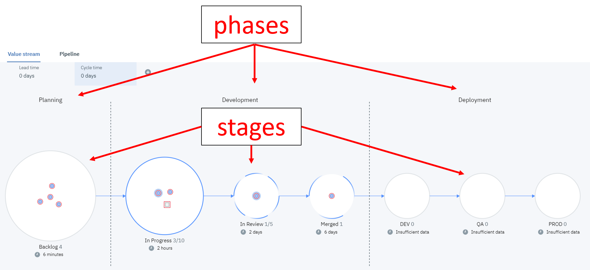

### Value Stream Basics

The concept of the value stream is to visualize work item progress through a series of stages (or states). UrbanCode Velocity Value Streams are flexible, interactive, and informative: consolidating the data from large and complex processes into a single interface bringing to surface metrics and key performance indicators (KPIs) with plenty of details under the hood.

\>> [More about value streams here](https://mediacenter.ibm.com/media/What+is+Value+Stream+ManagementF/1_6t0uxrn6/73629892)

**1. Value Stream Management (VSM) json file**
UrbanCode Velocity value streams are fully configurable by downloading and uploading a value stream management (VSM) json file.

  

**2. Organized as stages within phases**

### Workbook
1. [Creating a new value stream](newValueStream/newValueStream.md)
2. [Adding Integrations](addIntegrations/addIntegrations.md)
3. [Value stream stage queries](stageQueries/stageQueries.md)
4. [Link Rules](linkRules/linkRules.md)
